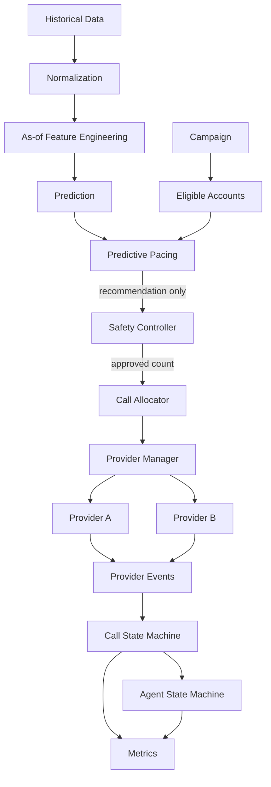

# CredResolve SmartDialer

## 1. Problem Statement

CredResolve needs to decide how much outbound collection work to offer without
overloading agents, accumulating ringing calls, duplicating account contacts,
or allowing provider failures to bypass operational safety. The prototype uses
historical CredResolve event data and simulated providers to make that control
flow measurable and explainable.

## 2. Solution Overview

The system combines:

- Leakage-safe historical features and answer-probability estimation
- Predictive Pacing for utilization-oriented recommendations
- An independent Safety Controller with hard limits and progressive fallback
- A Call Allocator for agent/account reservation and provider initiation
- Mock Telecom Providers A and B
- Event-driven call state handling
- Idempotent allocation and event processing
- Thread-safe concurrent agent/account reservation
- A reproducible 100-agent simulation and load/failure tests
- A lightweight FastAPI monitoring API and React/Vite dashboard

No real phone calls or telecom services are used.

## 3. Architecture



The most important boundary is:

```text
Pacing recommends -> Safety decides -> Allocator executes approved work -> Provider
```

Pacing cannot call a provider. Safety is independent and can approve, reduce,
reject, or select progressive fallback. The allocator validates the
`SafetyDecision` and cannot create more than `approved_calls`.

See [docs/architecture.md](docs/architecture.md) and
[docs/architecture-decisions.md](docs/architecture-decisions.md).

## 4. Key Design Principle

Predictive logic optimizes utilization; it does not have authority. The Safety
Controller applies deterministic limits to the recommendation. The Call
Allocator executes only the approved count after reserving an agent and account.
Provider failure, model error, or stale pacing state cannot create a path around
that boundary.

## 5. Dataset

The source is the supplied CredResolve CSV collection documented in
[data/README.md](data/README.md). The implemented normalization reads the
`accounts`, `calls`, `call_attempts`, and `call_dispositions` sources to produce
[data/processed/canonical_calls.csv](data/processed/canonical_calls.csv).

Operational identity is `account_id`; borrower identifiers are not used as the
reservation identity because the data contains borrower inconsistencies. The
normalizer parses timestamps into UTC, orders events by timestamp and event ID,
removes duplicate source IDs, corrects borrower mapping from the accounts table,
and maps source status/disposition fields into canonical outcomes. The observed
canonical call outcomes include `ANSWERED`, `BUSY`, `FAILED`, `NO_ANSWER`, and
`VOICEMAIL`.

The canonical stream contains 245,000 usable normalized events. The modeling
pipeline produces 90,000 call rows and records missing historical values and
leakage checks in [data/processed/feature_report.json](data/processed/feature_report.json).

## 6. Prediction

The target is `answered_next_call`: `1` when the current canonical call outcome
is `ANSWERED`, otherwise `0`. The 16 pre-call features include prior attempt
count, previous outcome, account/campaign/vendor/hour answer rates, recent
campaign rate, historical talk-time averages, attempt number, time fields,
campaign ID, and vendor ID.

Historical aggregates use only records with `event_at < T`. Current outcome,
current duration, future attempts, payments, complaints, promises, and later
account-status changes are not used. The model uses a chronological split:

```text
train:      62,084
validation: 12,128
test:       15,788
```

The evaluated model is regularized Logistic Regression with median numeric
imputation, scaling, categorical imputation, one-hot encoding, unknown-category
handling, class balancing, and `random_state=42`.

Measured test results from [data/processed/model_report.json](data/processed/model_report.json):

```text
                         ML              Statistical baseline
ROC-AUC                  0.4911          0.5000
PR-AUC                   0.1896          0.1940
Log loss                 0.6987          0.4921
Brier score              0.2528          0.1564
Accuracy                 0.4756          0.8060
Calibration error        0.3082          0.0048
Actual answer rate       0.1940          0.1940
```

The ML baseline is weak and poorly calibrated on this chronological test. The
smoothed statistical estimator is therefore the preferred pacing input. The ML
artifact remains an offline comparison and is not claimed to be production-ready.

## 7. Predictive Pacing

The Pacing Engine receives available agents, connected/ringing calls, answer
probability or historical fallback, average talk time, recent volume, provider
health/latency/failures, campaign behavior, and recent decisions.

It estimates expected answers as proposed calls multiplied by answer probability
and estimates agent demand from expected answers, talk time, and a planning
window. Ringing and connected calls consume outstanding capacity. Provider
health, latency, availability changes, talk time, and recent answer behavior
reduce the recommendation. The result is bounded and contains a reason,
confidence, and fallback flag.

## 8. Safety Controller

The Safety Controller is the hard boundary. `SafetyLimits` makes maximum
outstanding calls, calls per agent, provider failure/latency thresholds,
reservation timeout, minimum provider health, and maximum ringing calls
configurable.

`SafetyState` is evaluated independently of the prediction. The controller can
return `APPROVE`, `REDUCE`, `REJECT`, or `FALLBACK_TO_PROGRESSIVE`. It caps by
agent capacity, outstanding calls, campaign capacity, stale reservations, and
provider health. It never calls a provider.

## 9. Concurrency

`Agent.reserve()` uses a per-agent lock and changes `AVAILABLE` to `RESERVED`
atomically. `start_call()` changes `RESERVED` to `DIALING`; `release()` returns
the agent to `AVAILABLE`. The allocator uses another process-local lock for
account reservations, idempotency keys, and call creation coordination.

Duplicate jobs use campaign/account/allocation-window keys. A repeated job
returns the existing allocation and does not make another provider request.
These are process-local prototype guarantees, not distributed-storage claims.

## 10. Provider Handling

Provider A is a fast, reliable seeded mock with configurable latency and failure
probability. Provider B has higher latency, timeouts, failures, duplicate event
support, and out-of-order event support. `ProviderManager` selects a healthy
provider and retains the response/event source for the allocator and simulator.

Provider health exposes healthy status, latency, failure rate, and reason. The
providers do not make pacing or safety decisions. Events are handled separately
by the event processor.

## 11. State Machines

- [Agent state machine](docs/agent-state-machine.md): the allocator Agent uses
  `AVAILABLE`, `RESERVED`, and `DIALING`; the standalone full state machine
  supports `OFFLINE`, `AVAILABLE`, `RESERVED`, `DIALING`, `CONNECTED`,
  `WRAP_UP`, and `PAUSED`.
- [Call state machine](docs/call-state-machine.md): implemented states are
  `QUEUED`, `RESERVED`, `INITIATED`, `RINGING`, `ANSWERED`, `CONNECTED`,
  `COMPLETED`, `FAILED`, and `CANCELLED`.

The standalone `AgentStateMachine` implements those full lifecycle states;
the allocator's existing `Agent` remains the reservation-focused model.

## 12. Simulation

The default simulation uses:

```text
100 agents
1000 accounts
5 concurrent workers
```

Scenarios:

- A: 20% answer rate, 120-second average talk time
- B: 50% answer rate, 90-second average talk time
- C: 70% answer rate, 180-second average talk time
- D: changing conditions, including recent answer-rate collapse, provider
  degradation, and 100-to-60 agent availability

Measured run with seed `42`:

```text
Scenario | Answer Rate | Avg Talk | Initiated | Connected | Utilization | Safety Reductions | Provider Failures
A        | 0.200       | 120.0     | 100       | 20        | 0.080       | 1                 | 2
B        | 0.520       | 90.0      | 100       | 52        | 0.156       | 1                 | 2
C        | 0.720       | 180.0     | 100       | 72        | 0.432       | 1                 | 2
D        | 0.649       | 180.0     | 114       | 74        | 0.389       | 1                 | 2
```

Scenario D changed from 100 agents/request 200/approval 100 to 60 agents,
request 14/approval 14. Its reason included agent availability reduction,
provider latency/failure reduction, and recent answer rate below estimate.
Utilization is connected agent seconds divided by available agent seconds; it is
calculated from simulation events.

## 13. Failure Testing

The failure layer verifies provider failover, stale reservation recovery,
source-of-truth reconciliation, retry storms, duplicate events, and out-of-order
terminal events. A worker retry after successful initiation returns the existing
idempotent allocation. A provider outage does not cancel existing event streams;
new work is reduced, rejected, or routed to another healthy provider.

The load report covers 5, 10, 20, and 50 workers. Each run created 100 unique
calls with zero invariant violations and one explicit duplicate-job replay.

## 14. Testing

The final repository test command is:

```text
python -m pytest -q
```

Final measured result:

```text
77 passed
```

The API has tests covering dashboard summary, provider health, and scenario
execution.

## 15. Running the Project

PowerShell setup:

```powershell
python -m venv .venv
.\.venv\Scripts\Activate.ps1
python -m pip install -r requirements.txt
```

`requirements.txt` lists the packages used by the tests, ML pipeline, FastAPI
backend, and dashboard-adjacent Python tooling.

Prepare or regenerate the modeling dataset:

```powershell
python -c "from app.data.feature_pipeline import build_modeling_dataset; build_modeling_dataset()"
```

Train the offline model and report:

```powershell
python -m app.ml.train
```

Run tests and simulation:

```powershell
python -m pytest -q
python scripts/project_check.py
python scripts/run_simulation.py --all --seed 42
python -m app.simulation.load_test
uvicorn app.main:app --reload
```

In a second PowerShell terminal, run the dashboard:

```powershell
cd dashboard
npm install
npm run dev
```

The dashboard reads `/api/dashboard/summary`, `/api/pacing/current`,
`/api/providers`, and `/api/simulation/run`; it does not contain business logic
or fabricated metrics.

## 16. Project Structure

```text
app/
  data/          normalization, features, feature pipeline
  dialer/        pacing, predictive pacing, allocation
  ml/            model, training, prediction, evaluation
  models/        Agent
  state/         full Agent state machine
  providers/     interface, Provider A/B, manager, events
  safety/        Safety Controller
  simulation/    scenarios, simulator, metrics, runner, load/failure tests
data/
  raw CSV datasets/
  processed/     canonical, modeling, feature/model/load reports
models/          answer_probability_model.joblib
scripts/         simulation, provider demo, project check
dashboard/       React/Vite monitoring UI
tests/           unit, integration, API, concurrency, load, and failure tests
docs/            architecture, decisions, state, operations, submission notes
```

## 17. Limitations

This is a simulation, not real telecom traffic. The source data contains
missing values, duplicates, inconsistent identifiers, multiple schemas, and
late/conflicting event conditions. The ML model performed poorly compared with
the statistical baseline. Runtime reservations and event IDs are process-local
and not durable across processes. The agent model does not implement offline,
connected, wrap-up, or paused states. Provider timing and failure behavior are
seeded simplifications.

## 18. Scaling

At 100 agents, process-local locks and in-memory maps are adequate for the
prototype. At 1,000 agents, shared reservation contention, account hot spots,
event processing, provider throughput, and metrics aggregation become more
important. At 10,000 agents, reservations/idempotency need durable partitioned
state, event processing needs partitioned or batched ingestion, provider calls
need explicit throughput/rate controls, hot campaigns need partition-aware
scheduling, and metrics need scalable aggregation. These are analysis points,
not implemented infrastructure.

# Credresolve_AI_Engineer