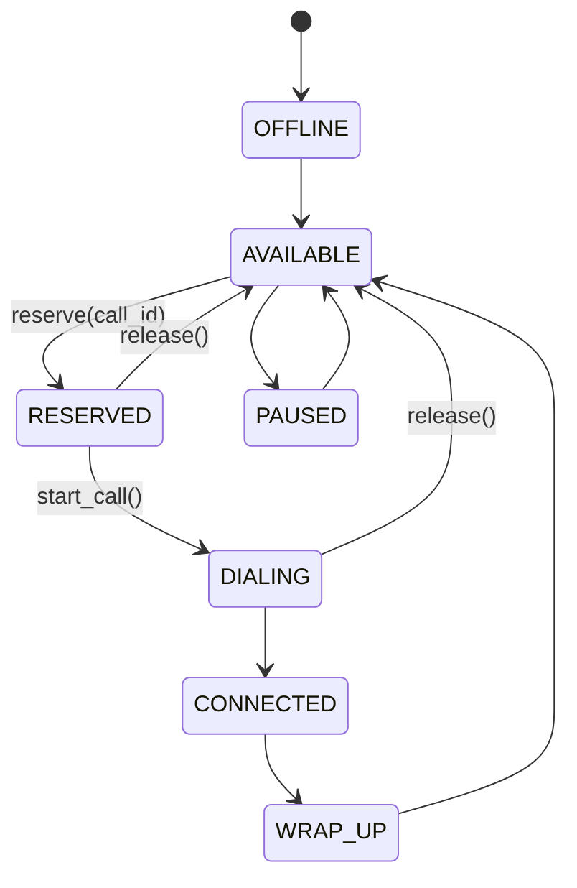

# Agent State Machine

## Implemented states

The allocator-focused `Agent` implements three reservation states as strings,
while `AgentStateMachine` in `app/state/agent_state.py` implements the full
operational lifecycle:

- `AVAILABLE`: the agent has no active call and may be reserved.
- `RESERVED`: the allocator has atomically claimed the agent for a call.
- `DIALING`: provider initiation succeeded and the agent is associated with the
  outbound call.

The full lifecycle additionally includes `OFFLINE`, `CONNECTED`, `WRAP_UP`, and
`PAUSED`.

`release()` clears `current_call_id` and returns the agent to `AVAILABLE`. The
current prototype does not model connected, wrap-up, pause, or offline agent
operations; simulation utilization is calculated from accepted provider
`CONNECTED` events rather than additional agent enum states.

## Concurrency

Every `Agent` owns a `threading.Lock`. `reserve()` checks both state and
`current_call_id` while holding that lock, then sets the call ID and state in the
same critical section. A competing worker therefore sees `RESERVED` and fails
rather than overwriting the reservation. The allocator also protects its
account and idempotency maps with a shared lock.

This is a process-local guarantee. Cross-process reservations would require a
durable transactional lease or equivalent coordination mechanism, which is not
part of this prototype.

## Failure behavior

If provider initiation fails before the call is accepted, the allocator calls
`release()` and the agent becomes available for a retry. Stale reservations are
recovered by the allocator timeout method. If initiation succeeded, an
idempotency record prevents a retry from creating another call; provider/event
reconciliation remains responsible for the later lifecycle.
