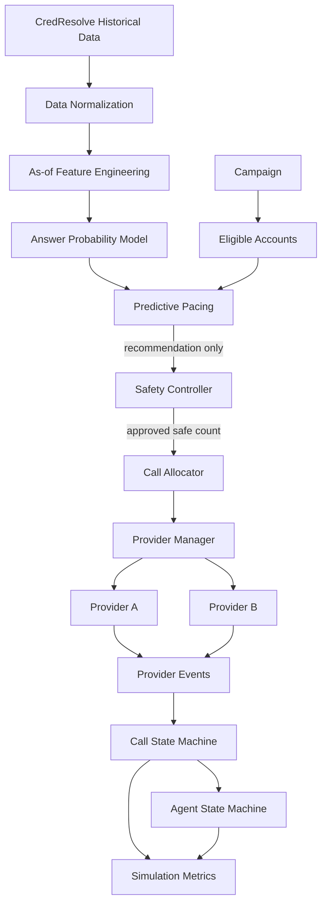

# CredResolve SmartDialer Architecture

## System view



The prototype is a Python, in-memory simulation. Its default workload is 100
agents, 1000 accounts, five concurrent workers, and two deterministic mock
providers.

## Components

| Component | Responsibility | Inputs and outputs | Must not do |
|---|---|---|---|
| Data normalization | Combines calls, attempts, and dispositions into canonical events. | CSV source rows -> ordered canonical events. | Train models or place calls. |
| Feature engineering | Builds strictly as-of historical call features. | Canonical events -> modeling CSV and report. | Use current/future outcomes, payments, or complaints. |
| Prediction | Scores `P(answered_next_call)` with preprocessing and Logistic Regression; also provides the statistical estimator. | Pre-call features -> probability. | Decide safety or initiate calls. |
| Pacing Engine | Estimates how many calls could use capacity. | Agents, calls, probabilities, talk time, provider signals -> pacing recommendation. | Call a provider or authorize work. |
| Safety Controller | Applies deterministic hard limits. | Pacing decision and safety state -> approve, reduce, reject, or progressive fallback. | Call providers or trust prediction as authority. |
| Call Allocator | Reserves agents/accounts and creates approved provider requests. | Safety decision, agents, eligible accounts -> allocations. | Exceed approval, bypass safety, or interpret provider events as answer outcomes. |
| Provider Manager | Registers providers, selects a healthy lowest-latency provider, and retains responses/events. | Provider interface calls -> provider response/health/events. | Embed pacing or safety policy. |
| Provider A | Fast, reliable seeded mock provider. | Outbound call -> response and normal event sequence. | Make real telecom calls. |
| Provider B | Higher-latency, failure/timeout, duplicate/out-of-order seeded mock. | Outbound call -> response and adverse event sequences. | Make safety decisions. |
| Event Processor | Deduplicates event IDs and validates call transitions. | Provider events -> state, transitions, ignored-event reasons. | Reopen terminal calls. |
| Agent state machine | Protects one agent reservation with a per-agent lock. | Reserve/start/release -> state. | Represent connected/wrap-up states not implemented by the model. |
| Simulation | Runs scenarios and five-worker allocation phases. | Configuration and scenario -> actual allocations/events. | Claim to model real telecom traffic. |
| Metrics | Aggregates decisions, calls, events, failures, and utilization. | Actual simulation observations -> result tables/reports. | Fabricate utilization or performance. |

## Primary boundary

```text
Pacing Engine --recommendation--> Safety Controller
Safety Controller --approved count--> Call Allocator
Call Allocator --provider request--> Provider Manager
```

The pacing output is advisory. Safety independently checks agent capacity,
connected/ringing load, provider health, campaign limits, and configured hard
limits. It can `APPROVE`, `REDUCE`, `REJECT`, or
`FALLBACK_TO_PROGRESSIVE`. The allocator accepts a `SafetyDecision`, validates
that `approved_calls <= requested_calls`, and creates no more than the approved
count. Provider failure therefore cannot create a path around safety.

## Data and prediction path

Normalization reads the supplied CSV streams and writes canonical events.
Feature engineering uses only records with `event_at < T` for a prediction at
`T`, including smoothed account, campaign, vendor, and hourly rates. The model
pipeline handles missing numeric values, scales numeric fields, and one-hot
encodes categorical fields with unknown-category handling. The saved evaluation
found the Logistic Regression baseline weaker and less calibrated than the
statistical rate estimator, so the statistical estimator remains the preferred
pacing input.

## Failure and concurrency summary

Agent reservation is atomic under `Agent._lock`; allocator account and
idempotency state are protected by its process-local lock. Deterministic keys
prevent duplicate allocation jobs from creating duplicate provider requests.
Provider events are processed independently of initiation and terminal calls do
not reopen. Stale reservations can be recovered by the allocator timeout
function. These are prototype guarantees within one Python process.

## Scaling direction

At 100 agents, shared reservation and provider initiation are simple enough for
process-local state. At 1,000 agents, lock contention, account hot spots, event
processing, and provider throughput become visible. At 10,000 agents, the
in-memory reservation/idempotency store, event processing, metrics aggregation,
provider rate limits, and hot campaign partitions would need durable,
partitioned storage and batched event/counter processing. Those systems are not
part of this prototype.

## Design principle

Predictive logic optimizes utilization. Safety logic guarantees deterministic
constraints. The predictive system may recommend. The Safety Controller decides.
The Call Allocator executes only approved work. This separation allows models to
change without weakening hard operational controls.
