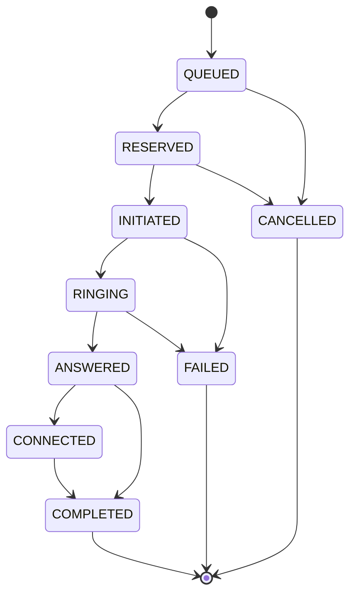

# Call State Machine

`CallState` is implemented in `app/providers/events.py` with these states:

- `QUEUED`
- `RESERVED`
- `INITIATED`
- `RINGING`
- `ANSWERED`
- `CONNECTED`
- `COMPLETED`
- `FAILED`
- `CANCELLED`

The allocator records a call lifecycle of `QUEUED`, `RESERVED`, and
`INITIATED`. Provider events normally move an initiated call through ringing,
answered, connected, and completed. Provider failure can move initiated or
ringing to `FAILED`. The event processor starts provider-event processing at
`INITIATED` by default.

## Duplicate events

The processor stores every processed `event_id`. A repeated ID is ignored and
recorded in `ignored_events`. Repeated `ANSWERED` events with different IDs do
not create repeated logical transitions: after the first answer, later answer
events are invalid for the current state and are recorded as ignored. The same
principle applies to repeated `COMPLETED` events after the call is terminal.

## Out-of-order events

A `COMPLETED` event is accepted as an explicit terminal fact even if it arrives
before expected intermediate events. Once the state is terminal, later
`ANSWERED`, `RINGING`, or other events are ignored with the reason
`terminal call cannot reopen`. This handles Provider B sequences such as
`COMPLETED`, `ANSWERED`, `RINGING` without reopening the call.

Other invalid transitions are rejected and recorded with
`invalid call-state transition`; the processor does not silently manufacture an
intermediate state.

## Worker crash after ANSWERED

The event processor can preserve the terminal/actual provider state independently
of the worker that delivered it. A worker retry must use the allocator’s
campaign/account/window idempotency key. If initiation already succeeded, the
existing logical allocation is returned instead of creating another call. Stale
reservation recovery is conservative and should be paired with provider
reconciliation before releasing an initiated resource in a production system.
